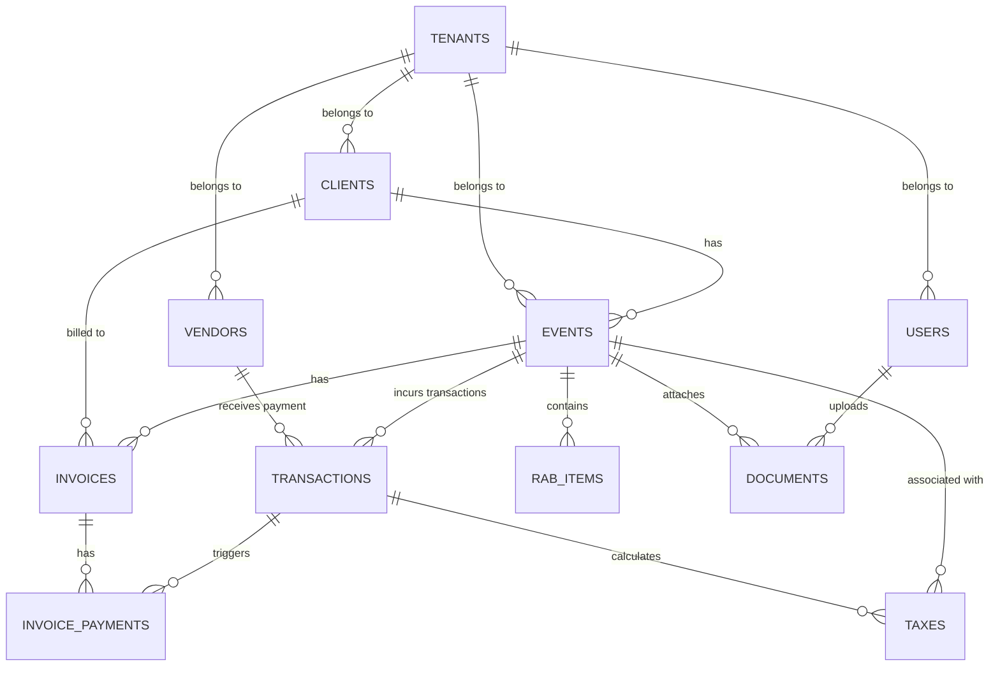

# Database Schema & Design - EventBooks

This document details the MySQL 8 database schema for EventBooks. The database is designed from the ground up to support SaaS multi-tenancy using a single-database shared-schema model, scoped via a `tenant_id` on all primary tables.

---

## 1. Entity-Relationship Diagram (ERD)

---

## 2. Table Specifications

### 2.1 tenants (Organizations)
Stores the master account or organization utilizing the platform.

| Column | Type | Nullable | Key | Default | Description |
| :--- | :--- | :---: | :---: | :--- | :--- |
| `id` | bigint (unsigned) | No | PK | | Unique auto-incrementing ID |
| `name` | varchar(255) | No | | | Company / Organization Name |
| `npwp` | varchar(20) | Yes | | NULL | Tax Identification Number |
| `email` | varchar(255) | Yes | | NULL | Primary contact email |
| `telepon` | varchar(20) | Yes | | NULL | Primary contact phone |
| `alamat` | text | Yes | | NULL | Company address |
| `created_at` | timestamp | Yes | | NULL | |
| `updated_at` | timestamp | Yes | | NULL | |

### 2.2 users
Stores user accounts. Scoped to a tenant.

| Column | Type | Nullable | Key | Default | Description |
| :--- | :--- | :---: | :---: | :--- | :--- |
| `id` | bigint (unsigned) | No | PK | | |
| `tenant_id` | bigint (unsigned) | No | FK | | Ref: `tenants.id` |
| `name` | varchar(255) | No | | | Full Name |
| `email` | varchar(255) | No | UK | | Login email (unique globally) |
| `password` | varchar(255) | No | | | Bcrypt hashed password |
| `role` | enum | No | | 'staff' | 'owner', 'finance_manager', 'admin', 'staff' |
| `telepon` | varchar(20) | Yes | | NULL | |
| `is_active` | boolean | No | | true | |
| `remember_token` | varchar(100) | Yes | | NULL | |
| `created_at` | timestamp | Yes | | NULL | |
| `updated_at` | timestamp | Yes | | NULL | |

### 2.3 clients
Stores client details. Scoped to a tenant.

| Column | Type | Nullable | Key | Default | Description |
| :--- | :--- | :---: | :---: | :--- | :--- |
| `id` | bigint (unsigned) | No | PK | | |
| `tenant_id` | bigint (unsigned) | No | FK | | Ref: `tenants.id` |
| `kode_klien` | varchar(50) | No | UK* | | Unique per tenant |
| `nama` | varchar(255) | No | | | Primary contact person |
| `perusahaan` | varchar(255) | Yes | | NULL | Company Name |
| `npwp` | varchar(20) | Yes | | NULL | Client tax ID |
| `email` | varchar(255) | Yes | | NULL | |
| `telepon` | varchar(50) | Yes | | NULL | |
| `alamat` | text | Yes | | NULL | |
| `created_at` | timestamp | Yes | | NULL | |
| `updated_at` | timestamp | Yes | | NULL | |

> **Index:** Unique index on `(tenant_id, kode_klien)` to ensure uniqueness per tenant.

### 2.4 vendors
Stores vendor details. Scoped to a tenant.

| Column | Type | Nullable | Key | Default | Description |
| :--- | :--- | :---: | :---: | :--- | :--- |
| `id` | bigint (unsigned) | No | PK | | |
| `tenant_id` | bigint (unsigned) | No | FK | | Ref: `tenants.id` |
| `kode_vendor` | varchar(50) | No | UK* | | Unique per tenant |
| `nama_vendor` | varchar(255) | No | | | Company / Vendor Name |
| `kategori` | enum | No | | 'lainnya' | 'dekorasi', 'sound_system', 'lighting', 'catering', 'venue', 'talent', 'mc', 'dokumentasi', 'transportasi', 'lainnya' |
| `npwp` | varchar(20) | Yes | | NULL | Vendor tax ID |
| `email` | varchar(255) | Yes | | NULL | |
| `telepon` | varchar(50) | Yes | | NULL | |
| `alamat` | text | Yes | | NULL | |
| `created_at` | timestamp | Yes | | NULL | |
| `updated_at` | timestamp | Yes | | NULL | |

> **Index:** Unique index on `(tenant_id, kode_vendor)`.

### 2.5 events
Event tracking details. Scoped to tenant.

| Column | Type | Nullable | Key | Default | Description |
| :--- | :--- | :---: | :---: | :--- | :--- |
| `id` | bigint (unsigned) | No | PK | | |
| `tenant_id` | bigint (unsigned) | No | FK | | Ref: `tenants.id` |
| `client_id` | bigint (unsigned) | No | FK | | Ref: `clients.id` |
| `nomor_event` | varchar(50) | No | UK* | | Unique code per event (e.g. EV-260601) |
| `nama_event` | varchar(255) | No | | | Event Title |
| `jenis_event` | varchar(100) | Yes | | NULL | e.g. Corporate Gathering, Wedding, Concert |
| `tanggal_mulai` | date | No | | | |
| `tanggal_selesai`| date | No | | | |
| `lokasi` | text | Yes | | NULL | Venue location |
| `nilai_kontrak` | decimal(15,2) | No | | 0.00 | Total contract value paid by client |
| `status` | enum | No | | 'draft' | 'draft', 'negosiasi', 'dp', 'berjalan', 'selesai', 'batal' |
| `created_at` | timestamp | Yes | | NULL | |
| `updated_at` | timestamp | Yes | | NULL | |

> **Index:** Unique index on `(tenant_id, nomor_event)`.

### 2.6 rab_items (Event Budget)
Tracks direct cost items for each event budget.

| Column | Type | Nullable | Key | Default | Description |
| :--- | :--- | :---: | :---: | :--- | :--- |
| `id` | bigint (unsigned) | No | PK | | |
| `tenant_id` | bigint (unsigned) | No | FK | | Ref: `tenants.id` |
| `event_id` | bigint (unsigned) | No | FK | | Ref: `events.id` (cascade on delete) |
| `kategori` | varchar(100) | No | | | e.g., Vendor Sound, Catering, Akomodasi, Ops |
| `deskripsi` | varchar(255) | No | | | Detailed description of budgeted cost |
| `qty` | decimal(10,2) | No | | 1.00 | Quantities |
| `harga` | decimal(15,2) | No | | 0.00 | Unit price |
| `subtotal` | decimal(15,2) | No | | 0.00 | Generated: `qty * harga` |
| `created_at` | timestamp | Yes | | NULL | |
| `updated_at` | timestamp | Yes | | NULL | |

### 2.7 transactions (Cash Book / Buku Kas)
Double-entry related ledger items representing cash inflows and outflows.

| Column | Type | Nullable | Key | Default | Description |
| :--- | :--- | :---: | :---: | :--- | :--- |
| `id` | bigint (unsigned) | No | PK | | |
| `tenant_id` | bigint (unsigned) | No | FK | | Ref: `tenants.id` |
| `event_id` | bigint (unsigned) | Yes | FK | NULL | Ref: `events.id` (optional for general expenses) |
| `nomor_transaksi`| varchar(50) | No | UK* | | e.g., TRX-2606001 |
| `tanggal` | date | No | | | Transaction date |
| `tipe` | enum | No | | | 'kas_masuk', 'kas_keluar' |
| `kategori` | enum | No | | | Inflow: 'dp_event', 'pelunasan_event', 'pendapatan_lain'. Outflow: 'pembayaran_vendor', 'transportasi', 'konsumsi', 'operasional', 'marketing' |
| `deskripsi` | text | No | | | |
| `nominal` | decimal(15,2) | No | | 0.00 | |
| `metode_pembayaran`| enum | No | | 'transfer_bank' | 'cash', 'transfer_bank', 'card', 'e_wallet' |
| `vendor_id` | bigint (unsigned) | Yes | FK | NULL | Ref: `vendors.id` |
| `created_at` | timestamp | Yes | | NULL | |
| `updated_at` | timestamp | Yes | | NULL | |

> **Index:** Unique index on `(tenant_id, nomor_transaksi)`. Index on `(tenant_id, tanggal)`.

### 2.8 invoices
Client billing files.

| Column | Type | Nullable | Key | Default | Description |
| :--- | :--- | :---: | :---: | :--- | :--- |
| `id` | bigint (unsigned) | No | PK | | |
| `tenant_id` | bigint (unsigned) | No | FK | | Ref: `tenants.id` |
| `client_id` | bigint (unsigned) | No | FK | | Ref: `clients.id` |
| `event_id` | bigint (unsigned) | No | FK | | Ref: `events.id` |
| `nomor_invoice` | varchar(50) | No | UK* | | Unique invoice code |
| `tanggal` | date | No | | | Issue date |
| `jatuh_tempo` | date | No | | | Due date |
| `jenis_invoice` | enum | No | | 'termin' | 'dp', 'termin', 'pelunasan' |
| `subtotal` | decimal(15,2) | No | | 0.00 | Base contract / milestone amount |
| `ppn` | decimal(15,2) | No | | 0.00 | Value-Added Tax (Calculated dynamically) |
| `total` | decimal(15,2) | No | | 0.00 | Subtotal + PPN |
| `status` | enum | No | | 'belum_bayar' | 'belum_bayar', 'sebagian', 'lunas', 'batal' |
| `created_at` | timestamp | Yes | | NULL | |
| `updated_at` | timestamp | Yes | | NULL | |

### 2.9 invoice_payments
Payment milestones matches against outstanding Invoices.

| Column | Type | Nullable | Key | Default | Description |
| :--- | :--- | :---: | :---: | :--- | :--- |
| `id` | bigint (unsigned) | No | PK | | |
| `tenant_id` | bigint (unsigned) | No | FK | | Ref: `tenants.id` |
| `invoice_id` | bigint (unsigned) | No | FK | | Ref: `invoices.id` |
| `transaction_id`| bigint (unsigned) | No | FK | | Link to cash book: `transactions.id` |
| `tanggal` | date | No | | | Payment date |
| `nominal` | decimal(15,2) | No | | 0.00 | Paid amount |
| `bukti_transfer`| varchar(255) | Yes | | NULL | File path to proof |
| `created_at` | timestamp | Yes | | NULL | |
| `updated_at` | timestamp | Yes | | NULL | |

### 2.10 taxes
Indonesian tax ledger record (PPN and PPh 21/23).

| Column | Type | Nullable | Key | Default | Description |
| :--- | :--- | :---: | :---: | :--- | :--- |
| `id` | bigint (unsigned) | No | PK | | |
| `tenant_id` | bigint (unsigned) | No | FK | | Ref: `tenants.id` |
| `transaction_id`| bigint (unsigned) | Yes | FK | NULL | Ref: `transactions.id` |
| `event_id` | bigint (unsigned) | Yes | FK | NULL | Ref: `events.id` |
| `tipe_pajak` | enum | No | | | 'ppn_keluaran', 'ppn_masukan', 'pph_21', 'pph_23' |
| `dpp` | decimal(15,2) | No | | 0.00 | Dasar Pengenaan Pajak (Tax Base) |
| `tarif` | decimal(5,2) | No | | 0.00 | Percentage e.g. 11.00, 2.00, 4.00, 15.00 |
| `nominal_pajak` | decimal(15,2) | No | | 0.00 | Total calculated tax |
| `pihak_terkait_nama` | varchar(255)| Yes | | NULL | Vendor/Talent name or employee name |
| `pihak_terkait_npwp` | varchar(20) | Yes | | NULL | NPWP of talent/vendor |
| `masa_pajak` | varchar(7) | No | | | Tax Period format 'YYYY-MM' |
| `status` | enum | No | | 'terutang' | 'terutang', 'dibayar' |
| `created_at` | timestamp | Yes | | NULL | |
| `updated_at` | timestamp | Yes | | NULL | |

### 2.11 documents
Contains attachment paths for legal compliance.

| Column | Type | Nullable | Key | Default | Description |
| :--- | :--- | :---: | :---: | :--- | :--- |
| `id` | bigint (unsigned) | No | PK | | |
| `tenant_id` | bigint (unsigned) | No | FK | | Ref: `tenants.id` |
| `event_id` | bigint (unsigned) | Yes | FK | NULL | Ref: `events.id` |
| `nama_dokumen` | varchar(255) | No | | | e.g., Kontrak WO John-Doe |
| `tipe_dokumen` | enum | No | | | 'kontrak', 'invoice', 'kwitansi', 'faktur_pajak', 'bukti_transfer' |
| `file_path` | varchar(255) | No | | | GCS/S3 key or local storage path |
| `file_size` | int | Yes | | NULL | Size in bytes |
| `file_type` | varchar(50) | Yes | | NULL | mime-type (pdf, png, jpeg) |
| `uploaded_by` | bigint (unsigned) | No | FK | | Ref: `users.id` |
| `created_at` | timestamp | Yes | | NULL | |
| `updated_at` | timestamp | Yes | | NULL | |

---

## 3. Database Index Strategy
To guarantee database speeds as SaaS accounts grow, the following indices are created:

1. **Scoping Indexes:** Every table queried in normal routes has an index on `tenant_id` combined with secondary search columns:
   - `clients`: `(tenant_id, kode_klien)` (Unique)
   - `vendors`: `(tenant_id, kode_vendor)` (Unique)
   - `events`: `(tenant_id, status)` and `(tenant_id, nomor_event)` (Unique)
   - `transactions`: `(tenant_id, tipe, tanggal)`, `(tenant_id, event_id)`
   - `invoices`: `(tenant_id, status, jatuh_tempo)`, `(tenant_id, nomor_invoice)` (Unique)
2. **Tax Aggregation Indexes:**
   - `taxes`: `(tenant_id, tipe_pajak, masa_pajak, status)` to ensure rapid loading of monthly tax returns.
