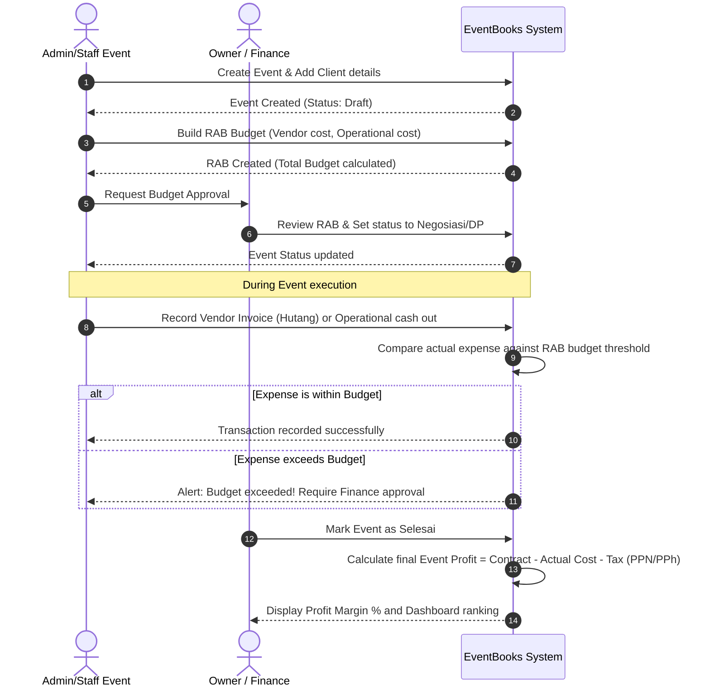
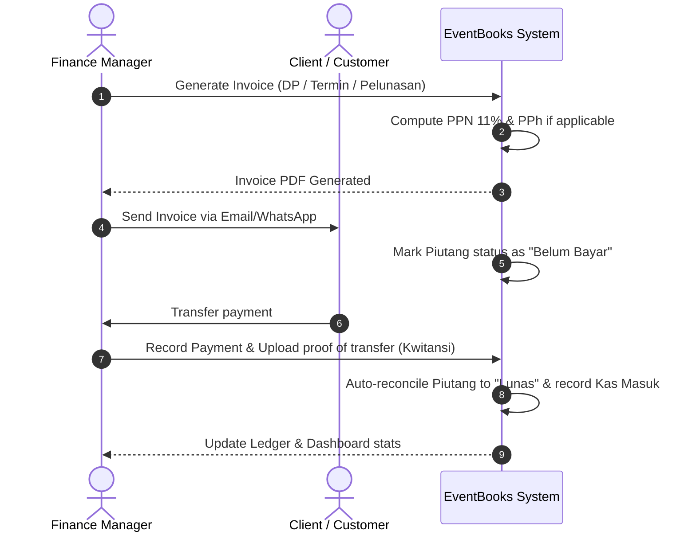

# Product Requirements Document (PRD) - EventBooks

EventBooks is an integrated bookkeeping, financial, and tax management application designed specifically for Event Organizers (EOs), Wedding Organizers (WOs), Concert Organizers, and Agencies. It enables companies to track their event budgets, vendor liabilities, client receivables, real-time event profits, and local tax compliance (PPN & PPh) in a single platform.

---

## 1. Product Overview & MVP Scope

### Target Users
- **Event Organizers** (Corporate & Corporate Agencies)
- **Wedding Organizers** (WOs)
- **Concert & Festival Organizers**
- **Campus & Community Organizers**
- **Creative Agencies**

### MVP vs. Future SaaS Features

| Feature Area | MVP Scope (Single Tenant / Organization Owner) | SaaS Enterprise Scope (Future Phase) |
| :--- | :--- | :--- |
| **Multi-Tenancy** | Single database structure with scoped queries (`tenant_id = 1` default). | Subdomain/Custom domain routing, isolated Tenant databases or strict dynamic tenant middleware. |
| **User Roles** | Owner, Finance Manager, Admin, Event Staff. | Custom roles, detailed granular permission settings per user. |
| **Tax Engine** | Automated PPN (11%/12%) and PPh 21 & 23 calculations for Indonesian tax regulations. | Multi-country tax configurations, integration with e-Faktur/tax filing APIs. |
| **Integrations** | Local and S3 storage for files; export to Excel and PDF. | Integration with payment gateways (Midtrans, Xendit), Xero/QuickBooks sync, bank feeds. |
| **Subscription & Billing** | None (Single account deployment). | Stripe/Midtrans billing integration, package tier limitations (max events, max storage). |

---

## 2. User Roles & Permission Matrix (RBAC)

The application implements Role-Based Access Control (RBAC) with four default roles.

| Module / Feature | Owner | Finance Manager | Admin | Event Staff |
| :--- | :---: | :---: | :---: | :---: |
| **Organization Settings & Users** | Write | Read | No Access | No Access |
| **Financial Reports & Ledger** | Write | Write | No Access | No Access |
| **Tax Rekap & Settings** | Write | Write | No Access | No Access |
| **Client & Vendor Master** | Write | Write | Write | Read |
| **Event Master & Status Change**| Write | Read | Write | Read |
| **RAB Budget Revision** | Write | Write | Write (Request) | No Access |
| **RAB Items (Draft/Add)** | Write | Write | Write | Write |
| **Transactions (Kas Masuk/Keluar)**| Write | Write | Write | No Access |
| **Invoices (Create/Send)** | Write | Write | Write | No Access |
| **Document Uploads** | Write | Write | Write | Write |

---

## 3. Sitemap

```mermaid
graph TD
    A[Login Page] --> B[Dashboard]
    B --> C[Master Data]
    C --> C1[Klien / Clients]
    C --> C2[Vendor / Vendors]
    
    B --> D[Event Management]
    D --> D1[Daftar Event / Event List]
    D --> D2[Detail Event]
    D2 --> D2a[RAB / Budget Builder]
    D2 --> D2b[Transaksi Event / Ledger]
    D2 --> D2c[Invoices / Termin]
    D2 --> D2d[Dokumen / Lampiran]

    B --> E[Pembukuan / Cash Book]
    E --> E1[Kas Masuk / Cash In]
    E --> E2[Kas Keluar / Cash Out]
    
    B --> F[Hutang Piutang / AP-AR]
    F --> F1[Daftar Piutang Klien]
    F --> F2[Daftar Hutang Vendor]

    B --> G[Perpajakan / Tax Ledger]
    G --> G1[Rekap Bulanan]
    G --> G2[PPh 21 / PPh 23 Calculator]
    G --> G3[PPN Tracker]

    B --> H[Laporan Keuangan / Financial Reports]
    H --> H1[Laba Rugi / P&L]
    H --> H2[Arus Kas / Cash Flow]
    H --> H3[Buku Besar / Ledger]
    H --> H4[Neraca / Balance Sheet]
    H --> H5[Profitabilitas Event / Event Profit ranking]

    B --> I[Pengaturan / Settings]
    I --> I1[Profil Organisasi]
    I --> I2[Manajemen Pengguna]
end
```

---

## 4. User Flow

### 4.1 Event Budgeting & Cost Realization Flow
This diagram details how a Staff/Admin creates an event, designs the RAB, records actual transactions, and assesses final profitability.



### 4.2 Invoicing, Receivable, and Payment Flow



---

## 5. Development Roadmap

We adopt a 4-phase delivery plan to ensure that the core engine is robust and can scale to multi-tenant in the future.

### Phase 1: Foundation & Specs (Week 1)
- [x] Finalize PRD, Database Schema, and REST API specification.
- [ ] Initialize Laravel 12 API structure (Docker/Herd setup, migrations, models).
- [ ] Initialize Vue 3 + Tailwind CSS scaffold.
- [ ] Establish standard JWT/Sanctum authentication and organization scoping.

### Phase 2: Master Data & Budgeting Engine (Week 2-3)
- [ ] Develop CRUD for Clients and Vendors.
- [ ] Build Event Creator & RAB (Rencana Anggaran Biaya) builder.
- [ ] Implement Budget revision controls and validation rules (preventing unauthorized over-budget transactions).
- [ ] Build Document management (Uploading contracts, invoice PDFs, proof of payments).

### Phase 3: Bookkeeping & Tax Computations (Week 4-5)
- [ ] Build Transaction Ledger (Kas Masuk & Kas Keluar).
- [ ] Develop Invoice builder with tax options (including PPN outputs and PPh withholding deductions).
- [ ] Implement Accounts Payable (Hutang Vendor) and Accounts Receivable (Piutang Klien) trackers.
- [ ] Develop automatic monthly tax summary sheets (Rekap PPN, PPh 21, PPh 23).

### Phase 4: Financial Statements & Dashboard (Week 6)
- [ ] Build the financial statement aggregation engine (P&L, Cash Flow, Balance Sheet, Ledger).
- [ ] Develop high-fidelity Dashboard views with charts (Vite/Chart.js/ApexCharts) and dark mode.
- [ ] Conduct end-to-end integration tests and user acceptance testing (UAT).
